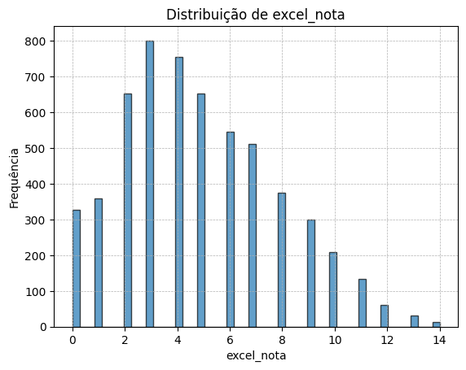

# Documentação Modelo Preditivo - Inteli

## Talent Tree
### Campari - Membros:
#### [Gustavo Wagon Widman](https://www.linkedin.com/in/gustavo-widman/)
#### [Luiza Rodrigues Santana](https://www.linkedin.com/in/luiza-santana-30007a264/)
#### [Matheus Ferreira Mendes](https://www.linkedin.com/in/matheusmeendes/)
#### [Rodrigo Sales Freire dos Santos](https://www.linkedin.com/in/rodrigo-sales-07/)
#### [Sophia Leite da Nóbrega](https://www.linkedin.com/in/sophianobrega/)
#### [Theo Albero Tosto](https://www.linkedin.com/in/th%C3%A9o-tosto-7a0a9922b/)

## Sumário
[1. Introdução](#c1)

[2. Objetivos e Justificativa](#c2)

[3. Metodologia](#c3)

[4. Desenvolvimento e Resultados](#c4)

[5. Conclusões e Recomendações](#c5)

[6. Glossário](#c6)

[7. Referências](#c7)

[Anexos](#attachments)

## 1. Introdução

&emsp;&emsp;&emsp;&emsp;Na seguinte documentação, apresentaremos o projeto desenvolvido para o Bettha, uma _startup_ criada pelo Grupo Cia de Talentos, em 2016. O Bettha tem como objetivo levar desenvolvimento para pessoas candidatas desde o início do processo seletivo, trabalhando no desenvolvimento profissional, gerando engajamento e aumentando a assertividade na seleção. A empresa busca auxiliar pessoas em início de carreira que buscam oportunidades de trabalho, oferecendo jornadas com conteúdos de _microlearning_ sobre _Soft Skills_ e _Hard Skills_, além da cultura da empresa, para facilitar a absorção de informações relevantes.
   
&emsp;&emsp;&emsp;&emsp;O problema identificado pelo Bettha é que pessoas em busca de emprego no início da carreira frequentemente desconhecem quais capacitações podem ser diferenciais para alcançarem sucesso ao se candidatarem para as vagas que almejam. Para solucionar essa questão, a empresa realiza mapeamentos comportamentais e cognitivos através de _Assessments_, avaliações ou testes utilizados para medir e avaliar diferentes aspectos das habilidades, tanto com as empresas contratantes quanto com os candidatos. Entretanto, atualmente, os resultados desses _Assessments_ não estão relacionados, dificultando a recomendação de vagas e capacitações relevantes para os candidatos.
   
&emsp;&emsp;&emsp;&emsp;Ao longo da documentação, detalharemos o projeto do motor de recomendação de vagas e trilhas de capacitação para pessoas candidatas, abordando suas etapas, metodologias e expectativas de resultados. O objetivo é fornecer uma visão clara do projeto e sua relevância para aprimorar a experiência dos usuários na plataforma do Bettha, proporcionando oportunidades de crescimento e sucesso em suas carreiras.
 
## 2. Objetivos e Justificativa
### 2.1 Objetivos

&emsp;&emsp;&emsp;&emsp;O objetivo geral do Bettha é levar desenvolvimento para pessoas candidatas desde o início do processo seletivo, trabalhando a marca empregadora, gerando engajamento e aumentando a assertividade na seleção. A empresa busca oferecer um ambiente onde pessoas em início de carreira possam encontrar oportunidades de trabalho, aprimorar suas habilidades e capacitações, e se preparar para conquistar suas vagas dos sonhos.

&emsp;&emsp;&emsp;&emsp;O Bettha tem como objetivos específicos oferecer jornadas educacionais com conteúdos de _microlearning_, abordando _Soft Skills_ e _Hard Skills_; realizar _Assessments_ para mapear características comportamentais e cognitivas; gerar recomendações personalizadas de vagas e capacitações com base nos resultados dos _Assessments_; aumentar a assertividade nos processos seletivos, tanto para empresas quanto para candidatos; fomentar o engajamento dos candidatos com a plataforma; e fortalecer a marca empregadora das empresas parceiras para atrair potenciais talentos e promover sua imagem no mercado de trabalho.

&emsp;&emsp;&emsp;&emsp;Resumindo, o Bettha tem como objetivo principal capacitar candidatos em início de carreira, oferecendo conteúdos relevantes e personalizados, recomendações de vagas alinhadas ao perfil de cada candidato e _insights_ para o desenvolvimento profissional. Ao mesmo tempo, busca potencializar a eficiência dos processos seletivos para empresas e fortalecer suas marcas empregadoras.

### 2.2 Proposta de solução

&emsp;&emsp;&emsp;&emsp;A proposta de solução se baseia no desenvolvimento de um modelo preditivo que possua um algoritmo de recomendação personalizada de vagas e capacitações para candidatos em início de carreira, baseado nos resultados dos _Assessments_ realizados pela plataforma. Esse modelo utilizará técnicas de _Machine Learning_ para analisar o perfil comportamental e cognitivo dos candidatos, bem como as características das vagas disponíveis, com o objetivo de realizar um _match_ mais preciso e relevante entre candidatos e oportunidades de emprego.

&emsp;&emsp;&emsp;&emsp;Através dos dados fornecidos pelo Bettha, que incluem informações sobre _Superfit_, _Lifestyle_ e _Workstyle_ de cada candidato ou empresa, se torna possível o desenvolvimento de um modelo preditivo inovador. Esses dados são valiosos para entender as competências e características de cada indivíduo, permitindo a construção de um sistema que preveja e identifique correspondências ideais entre candidatos e oportunidades.

&emsp;&emsp;&emsp;&emsp;No contexto dessas informações, _Superfit_ refere-se à avaliação de seis competências: consistente, pragmático, original, colaborativo, engajado e resiliente. Enquanto isso, _Lifestyle_ (para usuários) e _Workstyle_ (para gestores) avaliam duas categorias de competências. O _Lifestyle_ abrange os grupos _classic_, _order_, _change_, _tireless_ e _explorer_, enquanto o _Workstyle_ inclui _specialist_ e _generalist_ (além de _hybrid_ para candidatos).

&emsp;&emsp;&emsp;&emsp;O identificador único (_ID_) é um elemento chave que permite a identificação exclusiva de cada candidato ou empresa. Ele garante a integridade dos dados e ajuda a rastrear e analisar os perfis de maneira precisa.

&emsp;&emsp;&emsp;&emsp;Por meio desses dados, o modelo preditivo proporcionará recomendações mais refinadas e alinhadas com as características individuais. Isso não apenas aprimora a experiência dos usuários na plataforma Bettha, mas também contribui para um processo de seleção mais eficiente e eficaz, resultando em benefícios significativos tanto para os candidatos quanto para as empresas em busca de talentos. Esse modelo aumentará a assertividade das recomendações, o engajamento dos candidatos com a plataforma e tornará os processos seletivos mais eficientes para as empresas parceiras. Dessa forma, o modelo preditivo contribuirá para o desenvolvimento profissional dos candidatos e para o fortalecimento do Bettha como um ambiente valioso para busca de oportunidades de trabalho e crescimento na carreira.

### 2.3 Justificativa

&emsp;&emsp;&emsp;&emsp;Este tópico aborda a justificativa da solução proposta, destacando como o modelo preditivo de recomendação de vagas e capacitações atende às necessidades e oportunidades identificadas. Além disso, será detalhado os critérios que medirão o sucesso do projeto, como a precisão das recomendações e eficiência dos processos seletivos, contribuindo para uma compreensão abrangente da relevância e potencial da abordagem.

&emsp;&emsp;&emsp;&emsp;A proposta de solução para o desenvolvimento de um modelo preditivo de recomendação personalizada de vagas e capacitações é promissora e traz consigo uma série de benefícios significativos para a plataforma do Bettha. A principal característica que torna essa abordagem única e diferenciada no mercado de recrutamento e desenvolvimento de carreiras é a personalização das recomendações. Além de permitir uma maior otimização dos processos seletivos, a personalização da experiência do candidato gera uma fidelização, já que os candidatos tendem a retornar à plataforma para buscar novas oportunidades e capacitações. 

&emsp;&emsp;&emsp;&emsp;Ao oferecer uma plataforma inteligente e personalizada tanto para candidatos quanto para empresas, o Bettha se consolida como uma referência no mercado de recrutamento e desenvolvimento de carreiras. Essa reputação positiva atrairá mais usuários e parceiros corporativos, impulsionando ainda mais o crescimento da empresa e sua posição de liderança no mercado.

&emsp;&emsp;&emsp;&emsp;Já os critérios de sucesso serão avaliados por meio de uma variedade de indicadores que refletem sua eficácia e impacto. Primeiramente, a capacidade do modelo em alinhar variáveis relevantes, como habilidades e preferências, será medida, garantindo um _match_ eficaz. Além disso, a eficiência dos processos seletivos também será considerada, verificando se o tempo para encontrar correspondências adequadas é reduzido e mais efetiva. Através dessa análise, será possível ter uma visão clara do sucesso do projeto e sua capacidade de fornecer recomendações relevantes e benéficas para todas as partes envolvidas.

&emsp;&emsp;&emsp;&emsp;Em resumo, a proposta de solução é altamente vantajosa e tem o potencial de mudar a forma como as pessoas buscam oportunidades no mercado de trabalho e se desenvolvem profissionalmente. Com a personalização das recomendações, a otimização dos processos seletivos, a fidelização dos usuários e o crescimento do desenvolvimento profissional, o Bettha se tornará uma ótima plataforma para aqueles que buscam o sucesso em suas carreiras.

## 3. Metodologia
&emsp;&emsp;&emsp;&emsp;A metodologia ágil CRISP-DM (Cross-Industry Standard Process for Data Mining) é um processo iterativo, ou seja, apesar de seguir uma ordem ciclica, é possível que suas etapas sejam repetidas e executadas fora de ordem a qualquer momento do percurso do projeto caso haja necessidade. Composta por 6 etapas principais, as utilizadas até o momento para o desenvolvimento do modelo preditivo foram:

1. Entendimento do negócio: 
	no qual é feito um estudo do projeto a ser realizado, entendendo os objetivos do negócio e requisitos do cliente.
2. Entendimento dos dados: 
	é a fase de coleta, exploração e mineração, buscando um melhor entendimento dos dados que serão utilizados.
3. Preparação dos dados:
	nessa etapa os dados são selecionados, limpos, tranformados e preparados para serem de fato usados nos próximos passos.
4. Modelagem:
	esse é o processo que requer a seleção, treinamento e testagem dos algoritmos mais apropriados ao objetivo do projeto, pensando na validação, 	construção e avaliação do modelo.
5. Avaliação:
	uma vez criado os modelos, é necessário que seja feita a avaliação da qualidade e desempenho de cada um a partir de algumas métricas relevantes, 	considerando os objetivos iniciais do negócio. 

## 4. Desenvolvimento e Resultados
### 4.1. Compreensão do Problema
#### 4.1.1. Contexto da indústria  
&emsp;&emsp;&emsp;&emsp;Nesse tópico, será abordada uma análise detalhada do ambiente em que a empresa opera, utilizando o _framework_ das Cinco Forças de Porter como base. Este modelo estratégico examina os fatores que moldam a competitividade e a dinâmica da indústria, considerando aspectos como a ameaça de novos entrantes, o poder de negociação dos fornecedores e dos compradores, a presença de produtos substitutos e a rivalidade entre os concorrentes existentes. Por meio dessa avaliação abrangente, será possível compreender profundamente os elementos que influenciam a atuação da empresa no mercado, identificando oportunidades e desafios cruciais para o seu sucesso.

Figura 1 - Contexto da Indústria

Fonte: Elaborado pelos autores
 

#### 4.1.2. Análise SWOT 
&emsp;&emsp;&emsp;&emsp;Neste item, será abordada a análise *SWOT* do Bettha, elaborada por nós para entender melhor sobre o cenário interno da empresa. Essa é uma análise levando  em consideração tanto as forças e fraquezas da empresa, características que podem ser melhoradas ou reduzidas dentro da própria, quanto oportunidades e ameaças externas que a empresa não tem controle. 

Figura 2 - Análise SWOT

Fonte: Elaborado pelos autores

 

**Forças:**

&emsp;&emsp;&emsp;&emsp;A abordagem distinta, fundamentada em tecnologia avançada, oferece uma experiência totalmente digital e gamificada, inspirada em metodologias ágeis. Além disso, o Bettha se destaca pelo desenvolvimento personalizado de candidatos para vagas, alcançando um match altamente eficaz entre as habilidades e as demandas das vagas disponíveis. Com uma ampla variedade de vagas e parceiros empresariais, o Bettha oferece ainda capacitação gratuita e treinamento customizado. Sua posição de vanguarda é reforçada como a primeira _HR-Tech_ do Brasil a integrar a educação aos processos de RH, demonstrando um foco assertivo no crescimento e desenvolvimento dos candidatos.

**Fraquezas:**

&emsp;&emsp;&emsp;&emsp;Apesar de suas conquistas notáveis, o Bettha também enfrenta alguns desafios. A empresa enfrenta dificuldades em manter o engajamento dos usuários na plataforma, tanto antes quanto depois de estarem em busca de vagas. Além disso, a escalabilidade dos processos tem sido um obstáculo, assim como a percepção limitada de alguns usuários sobre a plataforma. Estas são áreas que requerem atenção contínua para garantir o sucesso contínuo do Bettha no mercado de Recursos Humanos.

**Oportunidades:**

&emsp;&emsp;&emsp;&emsp;O Bettha encontra-se diante de oportunidades significativas para expandir e fortalecer sua presença no mercado. O Brasil, com seu índice de turnover nas organizações sendo o dobro da média global, oferece um terreno fértil para os serviços da empresa, que podem ajudar a abordar essa questão. Além disso, a pandemia impulsionou a busca _online_ por vagas, beneficiando a plataforma. A alta competitividade nas vagas de _trainee_ é uma chance valiosa para o Bettha destacar-se ainda mais. A busca por parcerias estratégicas também pode abrir portas para crescimento e colaborações vantajosas, consolidando sua posição no setor de Recursos Humanos.

**Ameaças:**

&emsp;&emsp;&emsp;&emsp;Apesar do seu potencial, o Bettha enfrenta desafios no ambiente competitivo. O setor de RH tem sido afetado pelo baixo investimento das empresas e por um mercado que pode se movimentar de forma lenta. Além disso, a presença de várias empresas com propostas semelhantes no campo de RH aumenta a concorrência. No entanto, o Bettha possui uma vantagem considerável devido à quase inexistente barreira de entrada no mercado, o que pode permitir que ela navegue de maneira mais flexível e inovadora.

#### 4.1.3. Planejamento Geral da Solução

a) Dados disponíveis
- Os dados fornecidos pelo Bettha foram: cada competência de vários usuários e score de cada competência das vagas, ambos identificados através de um indentificador único para cada usuário e para cada vaga. Além disso, as competências dos usuários e vagas são diferenciadas entre a _superfit_ (mesmo nome para gestor e usuário), _lifestyle_ (usuários) e _workstyle_ (gestor).

b) Solução proposta
- A proposta de solução se baseia no desenvolvimento de um modelo preditivo que possua um algoritmo de recomendação personalizada de vagas e capacitações para candidatos em início de carreira, baseado nos resultados dos _Assessments_ realizados pela plataforma.

c) Tipo de tarefa
- A tarefa é do tipo de regressão porque estamos relacionando e cruzando os dados de várias variáveis para achar uma nova, no nosso caso, o match entre vaga e candidato.

d) Como a solução proposta deverá ser utilizada
- Inicialmente nossa solução vai ser utilizada localmente, já que nossa solução é um _MVP_. Porém, a solução desenvolvida poderá ser implementada na atual plataforma do Bettha.

e) Benefícios trazidos pela solução proposta
- Esse modelo aumentará a assertividade das recomendações, o engajamento dos candidatos com a plataforma e tornará os processos seletivos mais eficientes para as empresas parceiras. Dessa forma, o modelo preditivo contribuirá para o desenvolvimento profissional dos candidatos e para o fortalecimento do Bettha como um ambiente valioso para busca de oportunidades de trabalho e crescimento na carreira.

f) Critério de sucesso e qual métrica será utilizada para avaliá-lo
- Os critérios de sucesso do projeto serão: alto percentual de acerto, mapeamento preciso de vagas e eficácia na seleção. A métrica para medir esses objetivos vai ser o _feedback_ positivo do parceiro e correlação entre os nossos matchs e as os matchs de sucesso já feitos pelo Bettha.

#### 4.1.4. Value Proposition Canvas
&emsp;&emsp;&emsp;&emsp;Neste tópico, será abordado o _Value Proposition Canvas_ desenvolvido para o projeto. O _Value Proposition Canvas_ é um artefato utilizado por empresas para ajudar no compreendimento da proposta de valor em relação aos seus clientes. Ele consiste em dois componentes principais: o segmento do consumidor (com as suas tarefas, dores e ganhos) e a proposta de valor da empresa (com os produtos, aliviadores de dores e criadores de ganhos). A importância do _VPC_ vem de sua capacidade de conseguir alinhar o produto oferecido pela empresa com as necessidades de seu cliente, assim conseguindo criar produtos que tenham uma maior aderência ao mercado.

Figura 3 - Value Proposition Canvas

Fonte: Elaborado pelos autores

#### 4.1.5. Matriz de Riscos
&emsp;&emsp;&emsp;&emsp;Uma matriz de riscos de projeto é uma ferramenta de gestão essencial que desempenha um papel fundamental na identificação, avaliação e mitigação de possíveis obstáculos ao sucesso de um projeto. Ao mapear os riscos potenciais em uma estrutura visual, ela oferece clareza sobre as ameaças que podem afetar prazos, orçamentos e metas, permitindo que as equipes antecipem e planejem respostas adequadas. A matriz de riscos direciona a alocação eficiente de recursos para as áreas mais vulneráveis, ajuda na priorização de ações preventivas e facilita a comunicação transparente entre os membros da equipe e as partes interessadas, contribuindo, assim, para a tomada de decisões embasadas e a conquista bem-sucedida dos objetivos do projeto; veja a matriz elaborada pelo grupo no quadro abaixo:

Figura 4 - Matriz de Risco

Fonte: Elaborado pelos autores

 

1. No grupo, alguns membros apresentam uma predisposição a desenvolver doenças respiratórias, especialmente durante o inverno. Esse risco possui um impacto e probabilidade de ocorrência moderados, uma vez que não é possível prever com precisão, mas ainda assim afeta a produtividade do grupo. 
2. Durante as _sprints_, os membros gradualmente podem ficar cansados, o que pode levar a um desânimo coletivo. Esse risco possui um impacto e probabilidade moderados, uma vez que não está sob controle direto, afetando a produtividade, mas não a um nível preocupante.
3. O grupo tem a intenção de adotar um sistema de controle de versões para acompanhar o projeto, porém há uma possibilidade remota de ocorrer confusão entre as versões. Dado que o grupo está bem treinado, as chances disso acontecer são baixas, e o impacto também não seria muito significativo, já que se trata apenas de um método de organização.
4. Para um modelo preditivo, é requisitada uma precisão; caso o grupo não atinja um nível considerado aceitável, pode resultar em uma decepção coletiva. A probabilidade desse risco ocorrer é bastante reduzida, dado que o grupo possui uma ampla quantidade de dados para trabalhar, e a empresa expressou disposição em fornecer mais dados, se necessário. O impacto desse evento seria moderado, uma vez que o foco principal do projeto é a conexão de informações em vez de previsões absolutas.
5. Embora seja um risco de probabilidade muito baixa, existe a possibilidade de o projeto se tornar tão complexo a ponto de não conseguirmos concluir todas as entregas, o que resultaria em um impacto significativo devido ao não cumprimento do prazo.
6. O projeto pode se tornar tão complexo a ponto de não conseguirmos obter dados suficientes para alcançar um resultado aceitável. Caso a quantidade de dados disponíveis não seja adequada, a tarefa de obter um resultado satisfatório se tornará difícil, o que torna o impacto alto.
7. Em semanas que englobam feriados, a equipe enfrenta uma maior restrição de prazos e, adicionalmente, muitos membros demonstram relutância em executar tarefas remotamente. Isso, por sua vez, pode acarretar em um impacto considerável no desenvolvimento contínuo do projeto.
8. O histórico do VIA revela que, em algumas situações, houve falhas pontuais durante a conclusão das tarefas planejadas para a sprint. No entanto, é importante notar que essas ocorrências não apresentam um padrão regular, indicando que as falhas não acontecem de maneira consistente ao longo do tempo.
9. Existe a possibilidade de que uma determinada seção do projeto se torne tão intrincada ao ponto de causar um impedimento abrangente em todo o progresso do grupo, agindo como um obstáculo único.
10. Devido à falta de familiaridade geral com a linguagem _Python_ entre os membros, é possível que aqueles menos versados em programação enfrentem desafios adicionais. Isso pode resultar em um desequilíbrio na quantidade de contribuições, com alguns participantes fazendo mais commits do que outros.
11. A complexidade do projeto pode atingir um ponto em que se torne desafiador explicá-lo de maneira clara. Isso ocorre devido à sua profundidade e intricância, que podem dificultar a comunicação eficaz sobre seus detalhes e objetivos.
12. A presença de um membro do grupo com um conhecimento altamente avançado em _Python_ pode proporcionar uma oportunidade valiosa para aprimorar as habilidades de programação de todos. Essa colaboração interna pode facilitar o compartilhamento de conhecimento e permitir que o grupo avance coletivamente em suas habilidades de programação.
13. No contexto de desenvolvimento de um banco de dados, é possível buscar a criação de uma estrutura altamente eficiente com intervenções mínimas. Ao empreender esse esforço, a equipe pode almejar a construção de um banco de dados robusto e bem elaborado, que atenda de forma sólida às necessidades do projeto.
14. Utilizar a plataforma Bettha como ferramenta para buscar oportunidades de estágio e, em seguida, comparar as abordagens adotadas pelas empresas durante o estágio em relação ao nosso projeto.

#### 4.1.6. Personas
&emsp;&emsp;&emsp;&emsp;Neste item, será abordado as personas desenvolvidas para o desenvolvimento do projeto. Uma persona é uma construção que analisa o perfil do cliente ideal para uma determinada empresa. Ela é desenvolvida através da análise profunda de dados e padrões de comportamento de usuários típicos, e possui características como nome, idade, hábitos e demais detalhes relevantes. A criação dessa representação detalhada permite que as empresas abordem de maneira direcionada as necessidades e aspirações de seus clientes, estabelecendo uma conexão eficaz para alcançar com precisão seu público-alvo. Por meio dessa abordagem, as empresas podem compreender de forma holística as dores e desejos de seus clientes, capacitando-se a desenvolver estratégias mais impactantes e direcionadas.

Figura 5 - Persona: Empregadora

Fonte: Elaborado pelos autores

 

Figura 6 - Persona: Candidato

Fonte: Elaborado pelos autores

#### 4.1.7. Jornadas do Usuário
&emsp;&emsp;&emsp;&emsp;A seguir será demonstrado o Mapa da Jornada do usuário, que representa as etapas, fases e sentimentos que o usuário, nossa persona, passa durante toda sua experiência com a Bettha.

Figura 7 - Jornada do Usuário

Fonte: Elaborado pelos autores

&emsp;&emsp;&emsp;&emsp;Após analizarmos o mapa, foi possível observar que o usuário tem uma boa experiência com a plataforma do Bettha e tem suas expectativas atendidas ao final da jornada. Porém, é importante resaltar a oportunidade, que nós indentificamos, do Bettha poder ajudar o candidato a lidar com os sentimentos negativos durante a jornada, que são causados pela dificuldade dos processos seletivos e em alguns casos o tempo que o usuário está sem emprego.

#### 4.1.8 Política de Privacidade
&emsp;&emsp;&emsp;&emsp;A política de privacidade é uma salvaguarda essencial em nosso mundo digitalizado. Ela delineia como as informações pessoais são coletadas, usadas e protegidas, proporcionando transparência e confiança aos usuários. Ao definir limites claros e estar em conformidade com regulamentações, a política de privacidade não apenas protege os indivíduos, mas também preserva a reputação e integridade das organizações, promovendo uma relação ética e responsável com seus usuários. É a base para equilibrar a inovação tecnológica com a segurança e o respeito à privacidade.

   
Quais dados pessoais são coletados (inclusive os dados não informados pelo usuário, como IP, localização, etc)? 

&emsp;&emsp;&emsp;&emsp;Durante a jornada do usuário na plataforma da Bettha, existe 3 principais tipos de dados que são coletados: (i) dados de cadastro, tais como: o nome completo, número de Cadastro de Pessoa Física ('CPF'), endereço de e-mail, número de telefone celular, grau de escolaridade, áreas de interesse, conhecimento de idiomas, cidade, estado e país do titular; (ii) dados relacionados a testes realizados, vídeos e imagens postados, eventualmente necessários à realização do processo seletivo para o qual o titular se candidatou; e (iii) dados sensíveis relacionados à deficiência, etnia, gênero, orientação sexual e renda, cujo preenchimento é facultativo.

 Onde os dados são coletados (fonte)?

-   Quando o Usuário subscreve à plataforma usada pelo GCT (se registra, se inscreve ou se cadastra): para se cadastrar no banco de currículos do GCT é necessário que o USUÁRIO informe determinados dados pessoais, tais como nome completo, número de Cadastro de Pessoa Física ('CPF'), endereço de e-mail, número de telefone celular, grau de escolaridade, áreas de interesse, conhecimento de idiomas, cidade, estado e país, que são coletados pelo GCT para envio de convite(s) para participar tanto de processo(s) seletivo(s); quanto de pesquisa(s) e/ou evento(s) relacionados à carreira e/ou mercado de trabalho, bem como para realizar eventuais trilhas de desenvolvimento profissional disponibilizadas.

-   Através da utilização da plataforma adotada pelo GCT: quando o Usuário acessa o banco de currículos, realiza testes nele disponibilizados, se candidata a processos seletivos e/ou participa de pesquisas e/ou eventos para os quais foi convidado e/ou realiza trilhas de desenvolvimento profissional que venham a ser disponibilizadas, coletamos dados pessoais a partir dessa utilização de modo automático ou semiautomático;

-   Dados pessoais cujo fornecimento é opcional e que são coletados para proporcionar ao Usuário mais oportunidades: eventualmente, o Usuário também poderá nos fornecer dados pessoais adicionais ou nos autorizar a recolhê-los, por exemplo, para lhe fornecer mais oportunidades de emprego, trainee ou estágio. Conforme descrito abaixo, não coletamos, sem autorização prévia do Usuário, fotografias, vídeos, orientação sexual, dados referentes à saúde, localização ou dados de voz. O Usuário poderá sempre mudar de ideia e retirar o seu consentimento a qualquer momento.

-   Através de terceiros: receberemos dados pessoais do Usuário através de terceiros, incluindo empresas clientes, parceiros com quem trabalhamos, plataformas autorizadas pelo Usuário como o Linkedin, Gmail ou Facebook para lhe enviar convite para participação de processo seletivo, evento, pesquisa, dentre outros interesses relacionados à carreira e mercado de trabalho. Utilizaremos estes dados pessoais se o Usuário tiver autorizado os terceiros em questão.
  

Para quais finalidades os dados são utilizados?

Os tratamento de dados para fins de:

-   (a) envio de convites para participação de processos de recrutamento e seleção conduzidos por quaisquer das empresas do GCT, que - conforme as características do TITULAR - poderão ser para vagas de aprendiz, estágio, trainee ou emprego;

-   (b) realização de processo(s) seletivo(s) para o(s) qual(is) o TITULAR se candidatou à vaga;

-   (c) realização de jornada de desenvolvimento profissional;

-   (d) envio de convites para participação de pesquisas e eventos relacionados à carreira e mercado; que poderão ser acessados ou não pelo TITULAR;

-   (e) envio de links de terceiros, relacionados a conteúdos para aprimoramento profissional, que podem ser cursos, pesquisas, eventos, artigos, dentre outros correlatos, que poderão ser acessados ou não pelo TITULAR;

-   (f) envio de e-mail marketing sobre ações e atividades desenvolvidas pelo GCT ou com seu apoio, relacionados à carreira, mercado de trabalho e oportunidades de aprimoramento profissional.

-   (g) comunicar, fornecer, manter, e melhorar todo conteúdo disponibilizado nos sites do GCT;

-   (h) enviar ao TITULAR avisos técnicos e atualizações;

-   (i) responder os comentários, dúvidas e solicitações feitas pelo TITULAR;

-   (j) acompanhar e analisar tendências de uso.
  

Onde os dados ficam armazenados?

&emsp;&emsp;&emsp;&emsp;Os dados coletados através do cadastro de currículos feito através de quaisquer das empresas do GCT (CT -- Cia de Talentos Recursos Humanos Ltda; ER52 Tecnologia, Capacitação e Seleção Ltda; DM Vencer Recursos Humanos Ltda) serão armazenado em um único Banco de Dados, acessado por qualquer uma delas para atender à finalidade para a qual foi fornecido: envio de convites para participar de processos seletivos conduzidos por quaisquer dessas empresas, de eventos e pesquisa relacionados à carreira e ao mercado de trabalho.

Qual o período de armazenamento dos dados (retenção)?

&emsp;&emsp;&emsp;&emsp;Os dados pessoais do Usuário sõa conservados enquanto for necessário para o desenvolvimento dos processos de recrutamento e seleção conduzidos pelo GCT e para fins comerciais legítimos e essenciais, tais como para manter o desempenho da plataforma, tomar decisões empresariais acerca de funcionalidades e ofertas com base em dados, cumprir as nossas obrigações legais, e resolver disputas. Será conservado alguns dos dados pessoais do Usuário enquanto este permanecer como Usuário da plataforma. Por exemplo, mantemos todos os dados cadastrais e resultados de assessments na sua conta.

&emsp;&emsp;&emsp;&emsp;A pedido do Usuário, será elimindado os dados pessoais tratados com o consentimento do Titular ou anonimizar os dados pessoais nos termos da LGPD de modo que não o identifiquem, exceto se for legalmente permitido ou obrigatório manter determinados dados pessoais, incluindo situações como as seguintes:

&emsp;&emsp;&emsp;&emsp;Se existir um problema não resolvido relativamente à sua conta, como uma reclamação ou disputa não resolvida, os dados pessoais necessários serão retidos até que o problema seja solucionado;

&emsp;&emsp;&emsp;&emsp;Se formos obrigados a manter os dados pessoais para as nossas obrigações jurídicas, fiscais, de auditoria, contabilidade e conformidade com a LGPD, iremos reter os dados pessoais necessários pelo período exigido pela legislação aplicável;

&emsp;&emsp;&emsp;&emsp;Sempre que necessário para os nossos legítimos interesses comerciais, como a prevenção contra fraudes ou para manter a segurança dos nossos Usuários.

Uso de cookies e/ou tecnologias semelhantes?

Cookies Primários e Cookies de Terceiros

&emsp;&emsp;&emsp;&emsp;Utilizamos tanto cookies primários quanto cookies de terceiros no nosso website.

Cookies de sessão

&emsp;&emsp;&emsp;&emsp;Cookies da sessão são cookies temporários que são utilizados para lembrar de você durante o curso da sua visita ao website, e eles perdem a validade quando você fecha o navegador.

Cookies Persistentes

&emsp;&emsp;&emsp;&emsp;Cookies persistentes são utilizados para lembrar suas preferências do website e permanecem no seu desktop ou dispositivo móvel mesmo depois de você fechar o seu navegador ou efetuar uma reinicialização. Usamos estes cookies para analisar o comportamento do usuário e estabelecer padrões, de modo que possamos melhorar a funcionalidade do nosso website para você e outros que visitam o(s) nosso(s) website(s). Estes cookies também permitem que possamos oferecer anúncios segmentados e medir a eficácia do nosso site e a funcionalidade de tais anúncios.

Como os Cookies são usados para o propósito de anúncios?

&emsp;&emsp;&emsp;&emsp;Cookies e tecnologias de anúncios tais como 'web beacons', 'pixels' e 'tags' de redes de anúncios nos ajudam a oferecer anúncios relevantes de forma mais eficaz. Eles também nos ajudam a coletar dados consolidados para fins de auditorias, pesquisas e relatórios de desempenho para anunciantes. Os pixels permitem que compreendamos e possamos melhorar a oferta de anúncios para você, e permitem ainda saber quando determinados anúncios já foram apresentados a você. Como o seu navegador pode requisitar anúncios e 'web beacons' diretamente de servidores de rede de anúncios, estas redes podem visualizar, editar ou configurar seus próprios cookies, como se você tivesse acessado uma página web do site deles.

Com quem esses dados são compartilhados (parceiros, fornecedores, subcontratados)?

&emsp;&emsp;&emsp;&emsp;O TITULAR tem ciência de que seus dados pessoais serão compartilhados por cada empresa Controladora com outros agentes de tratamento de dados, sempre que necessário, para atendimento das finalidades listadas neste Termo, nos limites e condições fixados pela Lei Geral de Proteção de Dados Pessoais.

&emsp;&emsp;&emsp;&emsp;Esse compartilhamento se faz necessário para fins de realização de processos seletivos, envio dos convites listados neste Termo e para promoção das atividades do GCT junto ao TITULAR.

Informações sobre medidas de segurança adotadas pela empresa.

&emsp;&emsp;&emsp;&emsp;O GCT e suas empresas integrantes, se responsabilizam pela manutenção de medidas de segurança, técnicas e administrativas aptas a proteger os dados pessoais de acesso não autorizados e de situações acidentais ou ilícitas de destruição, perda, alteração, comunicação ou qualquer forma de tratamento inadequado ou ilícito. Na hipótese de ocorrência de incidente de segurança que possa acarretar risco ou dano relevante ao TITULAR, este será comunicado, assim como a Agência Nacional de Proteção de Dados (ANPD).

 Orientações sobre como a empresa/organização atende aos direitos dos usuários. 

   {Não achamos essa informação}

Informações sobre como o titular de dados pode solicitar e exercer os seus direitos.

A Lei Geral de Proteção de Dados confere ao TITULAR o direito:

(i) a confirmação da existência de tratamento;

(ii) ao acesso aos dados;

(iii) a correção de dados incompletos, inexatos ou desatualizados;

(iv) à anonimização, bloqueio ou eliminação de dados desnecessários, excessivos ou tratados em desconformidade com a LGPD;

(v) à portabilidade dos dados a outro fornecedor de serviço ou produto, resguardados os segredos comerciais e industriais do GCT;

(vi) à eliminação dos dados pessoais tratados com o consentimento do titular, exceto nas hipóteses de guarda legal e outras dispostas na LGPD;

(vii) à informação das entidades públicas e privadas com as quais o GCT realizou o uso compartilhado de dados;

(vii) à informação das entidades públicas e privadas com as quais o GCT realizou o uso compartilhado de dados;

(ix) à revogação do consentimento, nos termos da LGPD.

Informações de contato do Encarregado de Proteção de Dados (DPO - Data Protection Officer) da organização.

   {Não foi possível achar essas informações}

### 4.2. Compreensão dos Dados
&emsp;&emsp;&emsp;&emsp;A compreensão dos dados é um elemento crucial no mundo moderno, onde a informação é abundante e vital para tomadas de decisão acertadas. Entender os dados significa extrair significado, identificar padrões e inferir insights valiosos a partir das informações disponíveis. Essa habilidade possibilita uma melhor compreensão do ambiente em que vivemos, impulsiona a inovação e melhora a eficiência em diversos setores, desde negócios até ciência e saúde. Além disso, a compreensão dos dados é fundamental para a tomada de decisões informadas e fundamentadas, contribuindo para um futuro mais bem orientado e bem-sucedido.

#### 4.2.1. Exploração de dados
&emsp;&emsp;&emsp;&emsp;A exploração dos dados é um pilar essencial no mundo digital contemporâneo. Ela representa a capacidade de analisar e interpretar vastas quantidades de informações, transformando-as em conhecimento valioso. Ao explorar os dados de forma eficaz, é possível identificar tendências, insights e padrões que auxiliam na tomada de decisões informadas e estratégicas. Essa habilidade é vital em áreas como negócios, ciência, saúde e tecnologia, impulsionando a inovação e permitindo soluções mais eficazes para desafios complexos. Em resumo, a exploração de dados é um poderoso instrumento para orientar ações, promover a eficiência e alcançar metas de maneira mais efetiva.

**User superfit:**

|            | superfit_dis | superfit_sin | superfit_cur | superfit_int | superfit_eng | superfit_res |
|------------|--------------|--------------|--------------|--------------|--------------|--------------|
| count      | 73959.000    | 73959.000    | 73959.000    | 73959.000    | 73959.000    | 73959.000    |
| mean       | 57.326       | 49.855       | 44.041       | 52.177       | 48.233       | 51.197       |
| std        | 9.131        | 8.213        | 10.283       | 9.636        | 10.148       | 9.477        |
| min        | 0.000        | 0.000        | 0.000        | 0.000        | 2.000        | 4.000        |
| 25%        | 52.000       | 44.000       | 38.000       | 46.000       | 42.000       | 46.000       |
| 50%        | 58.000       | 50.000       | 44.000       | 52.000       | 50.000       | 52.000       |
| 75%        | 64.000       | 56.000       | 50.000       | 58.000       | 56.000       | 58.000       |
| max        | 90.000       | 90.000       | 94.000       | 92.000       | 90.000       | 88.000       |

Colunas Numéricas:

- superfit_dis
- superfit_sin
- superfit_cur
- superfit_int
- superfit_eng
- superfit_res
- id

Colunas Categóricas:
- key

**user_lifestyle:**

|            | lifestyle_classic | lifestyle_order | lifestyle_change | lifestyle_tireless | lifestyle_explorer | lifestyle_specialist | lifestyle_generalist | lifestyle_hybrid |
|------------|-------------------|-----------------|------------------|--------------------|--------------------|----------------------|----------------------|-----------------|
| count      | 67508.000         | 67508.000       | 67508.000        | 67508.000          | 67508.000          | 67508.000            | 67508.000            | 67508.000       |
| mean       | 2.216             | 3.464           | 5.775            | 4.740              | 5.032              | 1.859                | 1.470                | 0.876           |
| std        | 0.870             | 1.325           | 1.552            | 1.334              | 1.381              | 1.165                | 1.112                | 0.931           |
| min        | 0.000             | 0.000           | 0.000            | 0.000              | 0.000              | 0.000                | 0.000                | 0.000           |
| 25%        | 1.500             | 2.500           | 4.500            | 4.000              | 4.000              | 1.000                | 1.000                | 0.000           |
| 50%        | 2.000             | 3.500           | 6.000            | 4.500              | 5.000              | 2.000                | 1.000                | 1.000           |
| 75%        | 3.000             | 4.500           | 7.000            | 5.500              | 6.000              | 3.000                | 2.000                | 1.000           |
| max        | 8.500             | 24.500          | 18.000           | 22.500             | 23.500             | 5.000                | 5.000                | 4.000           |

Colunas Numéricas:

- lifestyle_classic
- lifestyle_order
- lifestyle_change
- lifestyle_tireless
- lifestyle_explorer
- lifestyle_specialist
- lifestyle_generalist
- lifestyle_hybrid
- id

Colunas Categóricas:
- key

**job_workstyle:**

|            | score_classic | score_order | score_change | score_tireless | score_explorer | score_specialist | score_generalist |
|------------|--------------|-------------|--------------|----------------|----------------|------------------|------------------|
| count      | 168.000      | 168.000     | 168.000      | 168.000        | 168.000        | 168.000          | 168.000          |
| mean       | 1.607        | 4.238       | 4.330        | 4.107          | 3.330          | 2.136            | 2.136            |
| std        | 0.898        | 1.270       | 1.091        | 1.114          | 1.427          | 1.077            | 1.153            |
| min        | 0.000        | 1.000       | 1.500        | 1.500          | 0.000          | 0.000            | 0.000            |
| 25%        | 1.000        | 3.500       | 3.500        | 3.500          | 2.000          | 1.000            | 1.000            |
| 50%        | 1.500        | 4.000       | 4.500        | 4.000          | 3.000          | 2.000            | 3.000            |
| 75%        | 2.000        | 5.000       | 5.000        | 5.000          | 4.500          | 3.000            | 3.000            |
| max        | 4.000        | 7.000       | 7.000        | 7.500          | 7.000          | 4.000            | 4.000            |

Colunas numéricas:
- id
- job_opportunity_id
- score_classic
- score_order
- score_change
- score_tireless
- score_explorer
- score_specialist
- score_generalist
- created_at
- uptaded_at

Colunas categóricas:
- avarege_distance

**job_opportunity_superfit_consolidates:**

|            | score_res | score_eng | score_int | score_cur | score_sin | score_dis |
|------------|-----------|-----------|-----------|-----------|-----------|-----------|
| count      | 169.000   | 169.000   | 169.000   | 169.000   | 169.000   | 169.000   |
| mean       | 32.533    | 29.503    | 33.988    | 27.077    | 33.373    | 35.846    |
| std        | 6.205     | 6.910     | 7.357     | 7.031     | 6.021     | 7.562     |
| min        | 16.000    | 10.000    | 16.000    | 12.000    | 16.000    | 8.000     |
| 25%        | 28.000    | 26.000    | 30.000    | 22.000    | 28.000    | 30.000    |
| 50%        | 32.000    | 30.000    | 34.000    | 26.000    | 34.000    | 36.000    |
| 75%        | 36.000    | 34.000    | 38.000    | 32.000    | 38.000    | 42.000    |
| max        | 46.000    | 46.000    | 52.000    | 46.000    | 48.000    | 52.000    |

Colunas numéricas:

- id
- job_opportunity_id
- score_res
- score_eng
- score_int
- score_cur
- score_sin
- score_dis
- created_at
- uptaded_at

**users_tests:**
|            | ingles_nota | excel_nota | solu_nota |
|------------|-------------|------------|-----------|
| count      | 12259.000   | 5732.000   | 19563.000 |
| mean       | 4.686       | 4.850      | 4.941     |
| std        | 3.367       | 2.968      | 2.084     |
| min        | 0.000       | 0.000      | 0.000     |
| 25%        | 1.280       | 3.000      | 3.300     |
| 50%        | 4.124       | 4.000      | 5.000     |
| 75%        | 8.412       | 7.000      | 6.500     |
| max        | 9.560       | 14.000     | 10.000    |

Colunas Numéricas:
- id
- ingles_nota
- excel_nota
- solu_nota

Colunas Categóricas:
- ingles_conceito
- excel_conceito
- solu_conceito

**users_contratados:**
Não há estatística descritiva, pois não há dados para uma base estatística.

Colunas Numérica:
- id

**user_objectives:**
- Desenvolvimento Pessoal: 13961
- Procurar emprego: 13863
- Melhorar minha carreira: 12365
- Autoconhecimento: 8693

Colunas Numéricas:
- id

Colunas Categóricas:
- name

**user_journeys:**
Não há estatística descritiva, pois não há dados para uma base estatística.

Colunas Numéricas:
- user_id
- journey_id
- fim

** user_interests:**
- Administrativo: 8490
- Marketing / Comunicação: 6928
- Tecnologia: 6565
- RH: 5298
- Comercial / Vendas: 5174
- Produção / Operações: 5036
- Logística / Supply Chain: 3705
- Finanças / Contabilidade: 3587
- Saúde: 3250
- Engenharia: 2923
- Jurídico: 1861

Colunas Númerica:
- id

Colunas Categórcas:
- name

**journeys:**
| type                    | category_type | average_rating | count |
|-------------------------|---------------|----------------|-------|
| increase_employability  | content       | 5.0            | 83    |
| portable_skills         | content       | 5.0            | 31    |
| increase_employability  | tests         | 5.0            | 31    |
| know_myself_better      | content       | 5.0            | 27    |
|                         |               | 4.5            | 24    |
| soft_skills             | content       | 5.0            | 16    |
| increase_employability  | content       | 4.5            | 14    |
| career_knowledge        | content       | 5.0            | 13    |
| pss_engineering         | content       | 5.0            | 9     |
| increase_employability  | tests         | 4.5            | 8     |
|                         | register      | 5.0            | 7     |
| soft_skills             | content       | 4.5            | 6     |
| increase_employability  | assessment    | 5.0            | 6     |
| pss_engineering         | content       | 4.5            | 6     |
| portable_skills         | content       | 4.5            | 5     |
| career_knowledge        | register      | 5.0            | 4     |
|                         | content       | 4.5            | 4     |
| know_myself_better      | assessment    | 5.0            | 4     |
| increase_employability  | register      | 4.5            | 3     |
| know_myself_better      | register      | 5.0            | 2     |
| pss_engineering         | register      | 5.0            | 2     |
| know_myself_better      | register      | 4.5            | 1     |
| increase_employability  | assessment    | 4.5            | 1     |
| pss_engineering         | content       | 4.0            | 1     |
| know_myself_better      | assessment    | 4.5            | 1     |
| pss_engineering         | register      | 4.5            | 1     |
|                         | tests         | 5.0            | 1     |
| soft_skills             | content       | 4.0            | 1     |
| increase_employability  | research      | 5.0            | 1     |
| portable_skills         | content       | 4.0            | 1     |

Colunas numéricas:
- id
- average_rating
- ratings_count

Colunas categóricas:
- name
- type
- category_type

### Gráficos

#### Média dos Superfit - Candidato x Vagas

Figura 8 - Média dos Superfit - Candidato x Vagas

Fonte: Elaborado pelos autores

**Análise do Gráfico**

&emsp;&emsp;&emsp;&emsp;Esse gráfico de radar compara as médias dos scores de superfit de usuários e gestores. A partir disso foi possível observar que a média dos superfit dos usuário é maior que a dos gestores em todas variáveis, em pelo menos 20 pontos. Além disso, esse tipo de gráfico nos possibilita facilitar a análise visual das diferenças nas médias, identificar rapidamente as áreas onde as médias dos dois grupos estão alinhadas e onde há discrepâncias significativas, ajuda a entender se as médias dos scores estão consistentes ou se variam amplamente. A análise desse gráfico pode ser feita de diversas maneiras, como por exemplo observando as diferenças e distância das pontuações nas formas dos polígonos entre os grupos, identificando quais scores estão mais alinhados ou divergentes. Além do mais, a compreensão das médias dos scores dos usuários e gestores nos ajuda a entender quais variáveis podem ter uma influência maior no resultado do nosso modelo preditivo e a validar nossas hipóteses.

#### Gráfico da Resultados por Percentil 75 do Superfit

Figura 9 - Gráfico da Resultados por Percentil 75 do Superfit

Fonte: Elaborado pelos autores

**Análise do Gráfico**

&emsp;&emsp;&emsp;&emsp;Analisando o gráfico de superfit, construído com base na média das melhores respostas dos conjuntos de dados disponíveis (percentil 75), é evidente que as competências de 'consciência', 'engajamento' e 'resiliência' demonstram as maiores discrepâncias entre os diferentes resultados. Essas informações podem ser utilizadas para identificar os três cursos mais adequados para um perfil específico. No contexto dessa análise, foram consideradas diversas respostas, porém, caso consigamos aplicar a mesma abordagem de forma individualizada, poderíamos desenvolver um programa capaz de prever quais cursos são mais apropriados para um candidato com base na vaga almejada. Isso abriria a possibilidade de uma orientação personalizada, utilizando-se de estratégias similares, para sugerir as melhores opções de formação.

##### Correlação entre os Superfits

Figura 10 - Correlação entre os Superfits

Fonte: Elaborado pelos autores

**Análise do Gráfico**

&emsp;&emsp;&emsp;&emsp;Esse gráfico em heatmap aborda uma matriz de correlação entre as competência de superfit dos candidatos e das vagas. Como base nesse gráficos, podemos presumir e entender como as competências dos candidatos estão se correlacionando com as características das vagas.

&emsp;&emsp;&emsp;&emsp;score_res (Resiliente): Correlação fraca e negativa (-0.042830). Isso sugere que não há uma forte relação linear entre a competência "resiliente" dos candidatos e as características das vagas. Pode ser que a competência resiliente não seja uma das principais considerações nas correspondências.

&emsp;&emsp;&emsp;&emsp;score_eng (Engajado): Correlação fraca e negativa (-0.073602). Similar à competência "resiliente", a competência "engajado" dos candidatos também não parece ter uma influência significativa nas correspondências com as vagas.

&emsp;&emsp;&emsp;&emsp;score_int (Colaborativo): Correlação moderada e positiva (0.101541). Aqui, vemos uma relação mais forte entre a competência "colaborativo" dos candidatos e as características das vagas. Uma correlação positiva indica que candidatos com habilidades colaborativas podem ter mais correspondências positivas com as vagas.

&emsp;&emsp;&emsp;&emsp;score_cur (Original): Correlação fraca e positiva (0.048058). A competência "original" apresenta uma correlação fraca e positiva, indicando que candidatos com essa habilidade podem ter alguma influência nas correspondências, mas não é tão determinante.

&emsp;&emsp;&emsp;&emsp;score_sin (Pragmatico): Correlação fraca e positiva (0.017968). A competência "pragmático" dos candidatos também apresenta uma correlação fraca e positiva, indicando que essa habilidade pode ter um papel menos significativo nas correspondências.

&emsp;&emsp;&emsp;&emsp;score_dis (Consistente): Correlação moderada e positiva (0.089666). A competência "consistente" dos candidatos apresenta uma correlação moderada e positiva com as características das vagas. Isso sugere que essa habilidade pode ter uma influência mais relevante nas correspondências.

#### Dispersão de User Lifestyle vs. Job Workstyles

Figura 11 - Dispersão de User Lifestyle vs. Job Workstyles

Fonte: Elaborado pelos autores

**Análise do Gráfico**

&emsp;&emsp;&emsp;&emsp;O gráfico mostra alguns pontos, os quais representam a relação entre a moda do estilo de vida do usuário e a moda do estilo de trabalho em uma vaga. A posição dos pontos no gráfico indica a relação entre esses dois conjuntos de dados. Por ter ter sido usado a moda de ambos os conjuntos de dados, é possivel analisar o valor mais comum de cada característica em relação ao gestor (da vaga) e ao usuário.

#### Gráfico de distribução de notas do teste de inglês

&emsp;&emsp;&emsp;&emsp;O gráfico abaixo isola as notas do teste de inglês (ingles_nota), remove os dados em branco e plota um gráfico que ilustra a distribuição dessas notas.

Figura 12 - Gráfico de distribução de notas do teste de inglês 1

Fonte: Elaborado pelos autores

&emsp;&emsp;&emsp;&emsp;O gráfico abaixo isola as notas do teste de excel (excel_nota), remove os dados em branco e plota um gráfico que ilustra a distribuição dessas notas.

Figura 13 - Gráfico de distribução de notas do teste de inglês 2

Fonte: Elaborado pelos autores

&emsp;&emsp;&emsp;&emsp;O gráfico abaixo isola as notas do teste SOLU, da Cia de Talentos (solu_nota), remove os dados em branco e plota um gráfico que ilustra a distribuição dessas notas.

Figura 14 - Gráfico de distribução de notas do teste de inglês 3

Fonte: Elaborado pelos autores

#### 4.2.2. Pré-processamento dos dados

&emsp;&emsp;&emsp;&emsp;Como parte do processo de preparação dos dados, realizamos uma análise das planilhas _user_superfit_, _user_lifestyle_, _job_workstyle_ e _job_superfit_, o que permitiu a identificação e remoção de colunas que não se alinhavam diretamente com os objetivos do projeto. Essa seleção de variáveis contribuiu para o direcionamento da análise das informações mais relevantes, otimizando assim o desempenho do modelo preditivo.

&emsp;&emsp;&emsp;&emsp;No que diz respeito às variáveis categóricas presentes nas demais tabelas, aplicamos uma abordagem de codificação precisa utilizando a técnica _one-hot encoding_. Essa etapa de transformação é importante para garantir que o modelo possa interpretar e utilizar de forma eficaz esses dados, aprimorando a qualidade das recomendações geradas.

&emsp;&emsp;&emsp;&emsp;É importante salientar que, em relação à detecção de outliers, a consistência dos dados coletados e disponibilizados permite a condução das análises sem identificar discrepâncias significativas. Dessa forma, foi optado por não aplicar tratamentos específicos nesse sentido, tendo em vista a solidez das informações fornecidas.

&emsp;&emsp;&emsp;&emsp;Vale destacar que, embora todas as tabelas enviadas tenham sido analisadas com atenção e rigor, é necessário mencionar que nem todas elas serão incorporadas diretamente ao modelo preditivo. A decisão de inclusão ou exclusão de tabelas foi pautada pelos objetivos específicos do projeto e pela relevância das informações contidas em cada uma delas. O foco está em utilizar as fontes de dados que possam contribuir de forma direta e substancial para a capacidade preditiva do modelo, permitindo recomendações mais assertivas.

&emsp;&emsp;&emsp;&emsp;Portanto, a seleção das tabelas que efetivamente farão parte do modelo tem o propósito de otimizar o desempenho e a utilidade das recomendações geradas, a fim de cumprir com os objetivos definidos para o projeto.

#### 4.2.3. Hipóteses

&emsp;&emsp;&emsp;&emsp;A partir das informações preparadas e obetidas até o momento, foram traçadas premissas que permitirão testar e validar as hipoteses levantadas, contribuindo para o desenvolvimento de um modelo preditivo preciso e eficiente. Essas hipóteses a seguir serão a base para desvendar padrões e aprimorar a qualidade das recomendações que o projeto visa alcançar, enriquecendo o valor que o projeto pode oferecer aos usuários.

1. **Hipótese de Correlação entre Competências e Recomendações:** Considerando a análise da matriz de correlação entre as competências dos candidatos e as características das vagas, esse hipótese sugere que competências específicas terão uma correlação mais forte com atributos específicos das vagas. Por exemplo, a competência "colaborativo" pode estar fortemente correlacionada com vagas que requerem trabalho em equipe e interação com outros membros da equipe. Da mesma forma, competências como "consistente" podem estar mais correlacionadas com vagas que exigem organização e atenção aos detalhes.
2. **Hipótese de Peso nas Competências Relevantes:** A partir da análise da matriz de correlação, essa hipótese é que competências com correlações mais altas terão um peso mais significativo na determinação do grau de correspondência entre candidatos e vagas. Por exemplo, se a competência "colaborativo" apresentar uma correlação mais forte com características específicas das vagas, ela terá um peso maior no cálculo geral do match. Isso sugere que o modelo irá priorizar competências que estão mais alinhadas com as características das vagas.
3. **Hipótese de Síntese entre Grupos de Competências:** Com base na divisão das competências em "_superfit_" e "_lifestyle/workstyle_", essa hipótese é que um modelo que leve em consideração ambas as categorias terá uma capacidade mais abrangente de prever as correspondências. Candidatos que possuem um equilíbrio entre habilidades técnicas ("_superfit_") e habilidades comportamentais ("_lifestyle/workstyle_") podem ter uma vantagem nas recomendações, uma vez que eles atendem tanto aos requisitos técnicos quanto culturais das vagas.
4. **Clusterização de Scores para Aprimorar o _Match_ entre Candidatos e Vagas:** O modelo preditivo de _match_ entre vagas e candidatos pode ser desenvolvido considerando uma abordagem de clusterização baseada nos _scores_ das categorias. Os scores de cada categoria podem ser usados para agrupar candidatos e vagas que possuem perfis semelhantes em um espaço de alta dimensionalidade. A hipótese sugere que, ao agrupar candidatos e vagas com base em suas características de scores em várias categorias, o modelo pode identificar perfis semelhantes entre os candidatos e as vagas. Isso permitiria que as empresas identificassem combinações mais precisas, alinhando candidatos a vagas que melhor se adequam às suas características e habilidades específicas. A clusterização pode ajudar a reduzir o tempo gasto na triagem manual e aumentar as chances de sucesso nas correspondências entre vagas e candidatos.

### 4.3. Preparação dos Dados e Modelagem

&emsp;&emsp;&emsp;&emsp;A preparação e modelagem de dados são passos essenciais na análise de dados, permitindo a eliminação de ruídos e a criação de estruturas que facilitam a extração de insights valiosos, contribuindo diretamente para a tomada de decisões informadas e eficazes.

a) Na busca por obter uma saída que apresentasse três gestores existentes para um usuário imaginário, uma estratégia foi adotada: um modelo baseado nas notas dos testes de personalidade dos usuários e gestores para prever a compatibilidade entre os dois, obtendo assim um gestor perfeito (e imaginário) para um usuário também imaginário que poderá servir para aproximar gestores reais.
Para treinar o modelo, era necessário ter algum tipo de aproximação entre usuários existentes e gestores existentes, então usou-se o algoritmo de aproximação KNN para aproximar cada usuário existente de três gestores existentes, utilizando as notas de personalidade de ambos e a sua correlação para esse treinamento.
Resumindo, o código segue a seguinte lógica: 
1. Aproxima 3 gestores existentes para cada usuário existente (Algoritmo KNN);
2. Utiliza as notas dos  usuários e seus gestores perfeitos para treinar um modelo regressor (Após testagem, escolhe-se o algoritmo Random Forest Regressor);
3. Utiliza o modelo para aproximar um gestor imaginário de um usuário imaginário (dado como input as notas de usuário, recebe-se como output as notas de um gestor);
4. Aproxima 3 gestores existentes do gestor obtido (Utilizando novamente o algoritmo KNN) 
Após testar o modelo, percebe-se que ele obtém resultados muito superiores ao algoritmo de aproximação, o KNN, além de possuir uma velocidade incomparável.

b) As métricas que utilizamos no conjunto de teste foram o coeficiente de determinação R^2: Esta métrica fornece uma compreensão de quão bem os valores previstos se ajustam aos dados reais. Um valor de R^2 igual a 1 indica previsões perfeitas, enquanto um valor de 0 indica que o modelo não é melhor do que simplesmente prever a média da variável-alvo para todas as observações.

RMSE (Erro Quadrático Médio Raiz): Esta métrica fornece uma interpretação semelhante à MAE, mas dá mais peso aos erros maiores (eleva ao quadrado os erros antes de calculá-los em média).

MAE (Erro Médio Absoluto): Esta métrica fornece uma ideia de quão erradas foram as previsões, nas mesmas unidades da variável de saída. Ela é menos sensível a valores discrepantes em comparação com o MSE.

c) Após achar os três gestores mais próximos de cada usuário através do algoritmo de KNN utilizando  distância euclidiana, fizemos o tratamento final dos dados, compilando usuários e gestores. Com esses dados nas mãos, fizemos a modelagem, escolhendo diversos algoritmos de regressão testando todos com as seguintes métricas de R^2 (Score/Coeficiente de Determinação), RMSE (Root Mean Squared Error/Erro quadrático médio raiz), MAE (Mean Absolute Error/Erro Médio Absoluto) e o tempo de treinamento do modelo. Os algoritmos utilizados para testar foram o Random Forest Regressor, KNeighbors Regressor, Gradient Boosting Regressor, MultiOutput Regressor + Linear Regression e Decision Tree Regressor. Após a análise dos algoritmos através das métricas mencionadas acima, o modelo escolhido foi o Random Forest Regressor obtendo os seguintes resultados:

|          **R^2**         	| 0.7245638200711281  	|
|:------------------------:	|---------------------	|
|          **MAE**         	| 0.04179377669519858 	|
|         **RMSE**         	| 0.07276298305893564 	|
| **Tempo de treinamento** 	| 45-50s              	|

### 4.4. Comparação de Modelos

&emsp;&emsp;&emsp;&emsp;A escolha das métricas de avaliação dos modelos foi feita considerando as características dos dados e a natureza dos algoritmos de regressão empregados. Para este projeto, optou-se por utilizar três métricas que se mostram particularmente apropriadas para avaliar a eficácia desses modelos: R², RMSE e MAE. A seguir vou detalhar mais o porque de cada métrica ser utilizada:

* R² (Coeficiente de Determinação): O R² é uma métrica que indica quanto da variação de uma variável dependente é explicada por uma variável independente em um modelo de regressão. No caso da nossa solução, esse grau de variação é a proximidade entre um usuário e o gestor fictício gerado para ele. Essa é a nossa métrica principal porque quanto mais próximo de 1 for o valor de R², mais bem o nosso modelo está se adaptando às semelhanças e relações entre os usuários e os gestores.

* RMSE (Erro Quadrático Médio): Essa é uma métrica que lida com os erros de predições, ela basicamente calcula "a raiz quadrática média" dos erros entre valores observados (gestores reais) e predições (gestores fictícios).  Ela vai indicar a diferença do erro entre o melhor gestor para um usuário que foi achado através do KNN e o gestor fictício gerado pelos modelos. Como está utilizando a raiz quadrática essa métrica penaliza mais os erros.

* MAE (Erro Médio Absoluto): Essa métrica é similar a do RMSE porém ela calcula o "erro absoluto médio" dos erros entre valores observados (gestores reais) e predições (gestores fictícios). Ela é menos sensível a outliers em comparação com o RMSE já que não utiliza uma raiz quadrática. Um MÃE, similar ao RMSE, baixo significa que o modelo consegue prever com consistência os resultados dos testes dos gestores mais compatíveis com os usuários.

&emsp;&emsp;&emsp;&emsp;Resumindo o R² mostrará o quanto o seu modelo explica a variância dos dados e o MAE e RMSE  dará uma visão complementar sobre como o modelo lida com erros do modelo. Durante a sprint 3, 4 e 5 grande parte do nosso trabalho foi voltado a otimizar os resultados dessas métricas.

#### *Random Forest*

**Descrição do Modelo:**

&emsp;&emsp;&emsp;&emsp;No primeiro modelo principal, utilizamos o algoritmo "Random Forest Regressor". Esse algoritmo é baseado no método de florestas aleatórias e é amplamente empregado em tarefas de previsão de valores com base em um conjunto de características. Ele opera criando múltiplas árvores de decisão e combinando suas previsões para gerar uma previsão final. As vantages desse algotimo que levaram sua escolha são: a combinação de várias árvores reduz a tendência de sobreajuste, é resistente a dados ruidosos e valores atípicos e geralmente oferece uma precisão maior em comparação com árvores de decisão individuais.
No contexto do nosso projeto, aplicamos esse algoritmo aos dados fornecidos nos DataFrames recebidos do Bettha com o objetivo de prever um gestor perfeito, dado um usuário real aleatório. Esse gestor perfeito, baseado no modelo, servirá para identificar 3 gestores reais (com auxílio do KNN) para fazer o match com o usuário escolhido.

**Otimização dos Hiperparâmetros:**

&emsp;&emsp;&emsp;&emsp;Para a otimização dos hiperparâmetros do modelo, realizamos uma busca em grade. Nesse processo, exploramos diversas combinações de hiperparâmetros com o propósito de melhorar o desempenho do modelo de regressão. Os hiperparâmetros considerados são:

- Número de árvores na floresta aleatória (n_estimators): Este parâmetro determina quantas árvores de decisão compõem o ensemble.
- Profundidade máxima das árvores (max_depth): A profundidade máxima de uma árvore de decisão influencia sua capacidade de ajuste aos dados. 
- Número mínimo de amostras necessárias para dividir um nó (min_samples_split): Esses parâmetros controlam o processo de divisão das árvores.
- Número mínimo de amostras necessárias para ser uma folha (min_samples_leaf): Esses parâmetros controlam o processo de criação de folhas.
- Número máximo de características a serem consideradas ao procurar a melhor divisão (max_features): Isso determina quantas características são avaliadas para cada divisão de nó.

Para determinar a combinação de hiperparâmetros que otimiza o desempenho do modelo em termos de coeficiente de determinação (R²), utilizamos a técnica de validação cruzada. Dividimos os dados de treinamento em subconjuntos e avaliamos o modelo em diferentes configurações de hiperparâmetros.

**Avaliação do Modelo:**

&emsp;&emsp;&emsp;&emsp;Uma vez que o modelo foi otimizado e treinado, aplicamos-o aos dados de teste. Em seguida, calculamos as métricas selecionadas anteriormente R², MAE, RMSE (melhor apresentadas no tópico anterior). Essas métricas nos auxiliam na avaliação do desempenho do modelo, o qual é avaliado a aproximação do R² a 1, e os menores valores devolvidos em MAE e RMSE.

|          **R^2**         	| 0.7245638200711281  	|
|:------------------------:	|---------------------	|
|          **MAE**         	| 0.04179377669519858 	|
|         **RMSE**         	| 0.07276298305893564 	|
| **Tempo de treinamento** 	| 45-50s              	|

#### *Random Forest Extra*

**Descrição do Modelo:**

&emsp;&emsp;&emsp;&emsp;No segundo modelo principal, foi feita a construção do modelo ExtraTreesRegressor, que é um algoritmo de aprendizado de máquina que segue o conceito de "ensemble learning", combinando as previsões de múltiplas árvores de decisão para criar um modelo poderoso e preciso. Assim como na Random Forest, as árvores de decisão são a base desse modelo, onde cada nó representa uma decisão baseada em um recurso específico, e as folhas representam os valores para problemas de regressão. Esse algoritmo possi algumas vantagens interessantes: reduz ainda mais a variância do modelo em comparação com o Random Forest e tende a ser mais tolerante a ruído nos dados.
Esse modelo também foi estruturado para seguir a linha de criação do "gestor perfeito".

**Otimização dos Hiperparâmetros:**

&emsp;&emsp;&emsp;&emsp;Foi essencial realizar a otimização dos hiperparâmetros para garantir seu desempenho máximo. Isso desempenha um papel crítico na capacidade do modelo de fazer previsões precisas e confiáveis em problemas de regressão. Durante o processo de otimização, exploramos diversas combinações de hiperparâmetros para aprimorar o desempenho global do modelo, que incluem:

- Número de árvores na floresta aleatória (n_estimators): Testamos diferentes valores para encontrar o número ideal de árvores que equilibra a variância e o viés do modelo.
- Profundidade máxima das árvores (max_depth): Buscamos a profundidade ideal para evitar overfitting ou underfitting.
- Número mínimo de amostras necessárias para dividir um nó (min_samples_split) e número mínimo de amostras necessárias para ser uma folha (min_samples_leaf): Ajustamos esses valores para evitar que as árvores se tornem muito complexas ou muito simples.
- Número máximo de características a serem consideradas ao procurar a melhor divisão (max_features): A seleção aleatória de um subconjunto de características introduz diversidade e robustez nas árvores.

**Avaliação do Modelo:**
	
&emsp;&emsp;&emsp;&emsp;Após a otimização dos hiperparâmetros, o modelo ExtraTreesRegressor foi treinado com os melhores valores selecionados. Posteriormente, aplicamos o modelo aos dados de teste para avaliar seu desempenho. As métricas de avaliação demonstraram que o modelo ExtraTreesRegressor apresenta um desempenho sólido na tarefa de regressão. Com um R² significativo e valores baixos de MAE e RMSE, o modelo é capaz de fazer previsões precisas e confiáveis, destacando sua utilidade em lidar com problemas de regressão complexos.

|          **R^2**         	| 0.7314620698757962  	|
|:------------------------:	|---------------------	|
|          **MAE**         	| 0.04249909426876933	|
|         **RMSE**         	| 0.07168746432709945 	|
| **Tempo de treinamento** 	| 45-50s              	|

#### *Neural Network (Rede Neural)*

**Descrição do Modelo:**

&emsp;&emsp;&emsp;&emsp;Por último, o terceiro modelo princiapl adotado neste projeto é uma rede neural. As redes neurais artificiais representam uma classe de modelos de aprendizado de máquina que se inspiram no funcionamento do cérebro humano. Elas são compostas por unidades de processamento chamadas neurônios artificiais. Cada neurônio recebe um conjunto de entradas, aplica uma função de ativação a essas entradas e gera uma saída. No contexto das redes neurais utilizadas neste projeto, a camada de entrada recebe dados brutos, enquanto as camadas intermediárias, conhecidas como camadas ocultas, realizam transformações complexas dos dados. Finalmente, a camada de saída produz a previsão final. A escolha desse modelo foi condicionada: por ser altamente paralelizável e pode ser acelerado usando GPUs, permitindo treinamento mais rápido em grandes conjuntos de dados e podem lidar com grandes volumes de dados e são escaláveis para problemas de grande escala.
E da mesma maneira que os modelos anteriores buscam pelo "gestor perfeito", esse também foi modelado para nesse conceito.

**Otimização de Hiperparâmetros:**

&emsp;&emsp;&emsp;&emsp;Durante o desenvolvimento do modelo de redes neurais artificiais, é crucial otimizar os hiperparâmetros para garantir seu desempenho máximo. Um hiperparâmetro fundamental é a taxa de aprendizado, que controla o tamanho dos passos dados pelo algoritmo de otimização (por exemplo, a descida de gradiente) ao ajustar os pesos da rede. A escolha adequada da taxa de aprendizado é essencial para o sucesso do treinamento da rede. Os hiperparÂmetros usados nessa caso foram:

- 'optimizer': define o algoritmo de otimização usado no treinamento da rede neural, sendo testadas as opções 'adam' e 'sgd'.
- 'dropout_rate': especifica a taxa de dropout, uma técnica de regularização que controla a probabilidade de desligar neurônios durante o treinamento, testando valores de 0.2, 0.3 e 0.4.
- 'num_units': descreve a arquitetura da rede neural, representando o número de neurônios em cada camada. Estão sendo testadas três arquiteturas diferentes.
- 'batch_size': determina o tamanho do lote de dados usado em cada iteração do treinamento, com testes para tamanhos de 32 e 64.
- 'epochs': define o número de épocas, ou seja, quantas vezes a rede neural percorre todo o conjunto de treinamento durante o treinamento, com testes para 50 e 100 épocas.

**Avaliação do Modelo:**

&emsp;&emsp;&emsp;&emsp;Após a busca em grade, obtivemos os melhores hiperparâmetros que maximizam o desempenho do modelo de redes neurais. Com esses hiperparâmetros otimizados, treinamos o modelo novamente e aplicamos-no aos dados de teste. As métricas de avaliação, como R², MAE e RMSE, nos permitiram avaliar o desempenho final do modelo otimizado em termos de sua capacidade de fazer previsões precisas e confiáveis em problemas de regressão. Os resultados obtidos demonstraram a eficácia da otimização de hiperparâmetros na melhoria do desempenho do modelo de redes neurais, tornando-o capaz de realizar previsões mais precisas e confiáveis em relação aos valores reais.

|          **R^2**         	| 0.8247258404480777  	|
|:------------------------:	|---------------------	|
|          **MAE**         	| 0.027868480777638278	|
|         **RMSE**         	| 0.05879378861142875 	|
| **Tempo de treinamento** 	| 45-50s              	|

#### *K-Neighbours*

**Descrição do Modelo:**

&emsp;&emsp;&emsp;&emsp;O sklearn.neighbors oferece funcionalidades para aprendizado de vizinhos mais próximos não supervisionado, que é a base para muitos outros métodos de aprendizado, como agrupamento espectral e aprendizado de variedades. Nesse contexto, o princípio é encontrar as amostras de treinamento mais próximas a um determinado ponto sem depender de rótulos predefinidos. Isso é útil para descobrir padrões e estruturas intrínsecas nos dados, auxiliando em análises exploratórias e segmentação dos dados sem a necessidade de informações de rótulos prévios. É uma técnica fundamental em ciência de dados quando não temos informações de classe para guiar o processo de aprendizado.

**Avaliação do Modelo:**

&emsp;&emsp;&emsp;&emsp;Como método de avaliação, utilizamos a distância entre o gestor e o usuário, permitindo assim uma conclusão sobre a performance do modelo. Essa distância é calculada considerando a coerência e relevância das respostas do modelo em relação às expectativas do usuário. Quanto menor a distância entre as respostas do modelo e as expectativas do usuário, melhor é a performance e a utilidade do modelo. Essa abordagem oferece uma maneira objetiva de quantificar a eficácia do modelo na tarefa proposta, proporcionando uma base sólida para tomada de decisões informadas sobre sua aplicabilidade e aprimoramento.

### 4.5. Avaliação
Simples e intuitivo: KNN é um algoritmo relativamente simples e fácil de entender. Não requer construção de modelos complexos e não faz suposições sobre a distribuição dos dados. O tornando uma escolha adequada quando os dados ou relacionamentos não são bem compreendidos. 
Capacidade de aprendizagem baseada em instâncias: KNN é um método de aprendizagem baseado em instâncias, o que significa que ele lembra o conjunto de dados de treinamento. Isso é útil ao combinar candidatos com vagas de emprego com base nas pontuações dos testes. Como o modelo armazena todos os exemplos de treinamento, ele pode tomar decisões com base na semelhança direta entre os resultados dos testes de um novo candidato e os de candidatos anteriores aprovados.
Sensibilidade ao Contexto: KNN considera a vizinhança de um ponto de dados para fazer previsões. Isto é valioso quando se procura compatibilidade, pois os candidatos compatíveis provavelmente terão resultados de testes semelhantes. Portanto, o KNN leva em consideração a proximidade no espaço de características, o que pode ser relevante na determinação da compatibilidade.
Ajuste de hiperparâmetros: você pode ajustar o valor "K" no KNN para controlar a sensibilidade do modelo. Isso permite ajustar o modelo para melhor atender à natureza dos seus dados e as necessidades do seu problema específico.
Treinamento incremental: KNN suporta treinamento incremental, podendo adicionar facilmente novos exemplos de treinamento à medida que mais candidatos e gerentes são adicionados ao sistema.

Forças do Negócio e Justificação:

Abordagem diferenciada e tecnologia avançada: A solução proposta inclui tecnologia avançada para fornecer aos usuários uma experiência digital. Recomendar empregos e habilidades personalizadas é uma abordagem específica que utiliza técnicas avançadas de aprendizado de máquina. 
Desenvolvimento pessoal dos candidatos: A recomendação pessoal baseada nos resultados da avaliação é essencial para o desenvolvimento pessoal do candidato. Aborda a necessidade de uma correspondência altamente eficaz entre competências e vagas. 

Fraquezas do Negócio e Como a Solução Ajuda:
Dificuldade em manter o envolvimento do usuário: referências personalizadas podem melhorar o envolvimento, fornecendo aos usuários recomendações relevantes e oportunidades de desenvolvimento que correspondam aos seus interesses e habilidades. 
Escalabilidade do processo: O uso de um modelo de aprendizado de máquina permite escalabilidade porque pode lidar com um grande número de usuários e vagas, adaptando-se automaticamente às mudanças no banco de dados. 
Percepção limitada de alguns usuários: A solução pode ajudar a melhorar a percepção dos usuários sobre a plataforma, mostrando resultados eficazes e relevantes que atendam às suas expectativas.

Oportunidades do Negócio e Como a Solução Aproveita:

Altamente competitivo para vagas de estágio: Uma recomendação pessoal pode ajudar os candidatos a se destacarem entre os estágios, fornecendo uma visão geral de suas habilidades e encontrando oportunidades de emprego. 

Ameaças do Negócio e Como a Solução Mitiga:

Concorrência em RH: As referências pessoais podem ser uma vantagem competitiva porque melhoram a experiência do usuário e a eficiência do processo seletivo e ajudam a empresa a se destacar em um mercado competitivo.

Monitoramento contínuo: Implementar um sistema de monitoramento contínuo do desempenho do modelo. Isso pode incluir o rastreamento de métricas de avaliação do modelo, como precisão, taxa de acerto e resultados falsos positivos/negativos.

Feedback do usuário: Incentivar os usuários a fornecer feedback sobre as recomendações recebidas. Isso pode ser feito por meio de comentários, avaliações ou pesquisas de satisfação. O feedback do usuário pode ser valioso para identificar rapidamente problemas com um modelo.

Explicabilidade Aumenta a Aceitação: Hipótese: Se o modelo fornecer explicações claras e compreensíveis para suas recomendações, a aceitação das recomendações será maior. Verificação: Realizar pesquisas de satisfação e coletar feedback dos usuários para avaliar se a explicabilidade aumenta a aceitação das recomendações. 
Usuários Valorizam Transparência: Hipótese: Os usuários valorizam a transparência e a capacidade de entender por que estão recebendo determinadas recomendações. Verificação: Realizar pesquisas para avaliar o grau de importância atribuído à transparência e à explicabilidade nas recomendações. 
Explicabilidade Reduz a Percepção de Viés: Hipótese: A explicabilidade pode ajudar a reduzir a percepção de viés nas recomendações, pois os usuários podem ver claramente os critérios utilizados. Verificação: Avaliar a percepção dos usuários sobre a imparcialidade das recomendações antes e depois da implementação da explicabilidade.

## 5. Conclusões e Recomendações

Métricas de Avaliação: Devido ao uso de um modelo não supervisionado, não aplicamos métricas tradicionais de classificação. Em vez disso, nossa principal métrica de avaliação é a distância euclidiana entre o perfil de um usuário e o perfil de um gestor.
Cálculo da Distância Euclidiana: A distância euclidiana é calculada medindo a diferença entre as características (ou competências) de um usuário e as de um gestor. Para cada competência, calculamos a diferença entre a pontuação do usuário e a pontuação do gestor, elevamos essa diferença ao quadrado e, em seguida, somamos todas essas diferenças quadráticas. Finalmente, tiramos a raiz quadrada da soma total para obter a distância euclidiana.
Testes de Matchs: Realizamos vários testes de matchs entre candidatos e vagas com base nas distâncias euclidianas calculadas. Por exemplo, se a distância euclidiana entre o perfil de um candidato e uma vaga for menor que um determinado limite, consideramos isso como um "match". Esses testes nos permitem avaliar a compatibilidade entre candidatos e vagas com base em suas competências.
Monitoramento Contínuo: Recomendação: Estabelecer um processo de monitoramento contínuo para avaliar o desempenho do modelo. Isso inclui o acompanhamento das métricas de avaliação, como precisão e engajamento dos usuários, e a identificação rápida de problemas ou falhas.
Feedback dos Usuários: Recomendação: Incentivar os usuários a fornecer feedback regularmente sobre as recomendações recebidas. Isso pode ser feito por meio de pesquisas de satisfação, formulários de feedback ou uma função de feedback incorporada à plataforma.
Transparência e Explicabilidade: Recomendação: Priorizar a transparência e a explicabilidade do modelo. Garantir que as explicações para as recomendações sejam claras e compreensíveis para os usuários, ajudando a construir confiança e aceitação.
Política de Privacidade e Proteção de Dados: Recomendação: Manter uma política de privacidade robusta que detalhe como os dados dos usuários são coletados, usados e protegidos. Certificar-se de estar em conformidade com as regulamentações de proteção de dados.
Atualizações Regulares: Recomendação: Planejar atualizações regulares do modelo com base no feedback dos usuários e na análise de desempenho. A melhoria contínua é essencial para garantir que as recomendações sejam cada vez mais precisas e relevantes.
Avaliação das Hipóteses: Recomendação: Continuar a avaliar as hipóteses relacionadas à explicabilidade e aceitação do modelo, ajustando a estratégia com base nos resultados da pesquisa e do feedback dos usuários.

## 6. Glossário

_microlearning_: uma abordagem educacional que se concentra na entrega de informações e conhecimentos em pequenas doses ou unidades de aprendizado altamente focadas.

_Soft Skills_: referem-se às características pessoais, traços, atitudes e comportamentos que moldam a maneira como uma pessoa interage e se relaciona com os outros, bem como como ela aborda situações e desafios no ambiente de trabalho e na vida em geral.

_Hard Skills_: são competências específicas e mensuráveis que envolvem conhecimento e capacidades técnicas para realizar tarefas específicas.

_Assessments_: são ferramentas e métodos utilizados para avaliar de forma sistemática as habilidades, conhecimentos, competências e características de um indivíduo. 

_insights_: referem-se a percepções profundas, entendimentos ou informações valiosas que são obtidas por meio da análise, observação ou reflexão sobre dados, situações ou experiências que podem gerar ideias para uma melhor orientação estratégica.

_Machine Learning_: Aprendizado de Máquina, é um campo da inteligência artificial que se concentra no desenvolvimento de algoritmos e sistemas capazes de aprender e melhorar a partir de dados.

_match_: refere-se à correspondência ou compatibilidade entre duas ou mais entidades, geralmente com base em características, interesses, requisitos ou critérios específicos.

_classic_: frequentemente utilizado para se referir a algo que é considerado tradicional, atemporal e de alta qualidade.

_order_: se refere à organização, estrutura e planejamento em um contexto profissional.
 
_change_: refere-se à adaptabilidade, flexibilidade e capacidade de lidar com mudanças em um contexto profissional.
 
_tireless_: se refere à perseverança, dedicação incansável e disposição para trabalhar de forma constante e diligente.
 
_explorer_: envolve a busca por novas possibilidades, a curiosidade e a disposição para explorar novos territórios em um contexto profissional.
 
_specialist_: se refere à expertise e ao foco em um campo específico de conhecimento ou habilidade em um contexto profissional.
 
_generalist_: está relacionada à habilidade de lidar com uma variedade de tarefas e conhecimentos em um contexto profissional.
 
_hybrid_: envolve uma combinação equilibrada de características de "_specialist_" e "_generalist_" em um contexto profissional.

_framework_: uma estrutura ou modelo conceitual que fornece orientação, diretrizes e um conjunto organizado de princípios para abordar um determinado problema, processo ou tarefa.

_HR-Tech_: uma abreviação para "Tecnologia de Recursos Humanos" (em inglês, Human Resources Technology). Refere-se ao uso de tecnologia, especialmente software e plataformas digitais, para otimizar e aprimorar processos relacionados à gestão de recursos humanos.

_online_: refere-se à conectividade e disponibilidade de informações, serviços ou atividades por meio da Internet.

_trainee_: indivíduo que participa de um programa de treinamento, geralmente em uma empresa ou organização, com o objetivo de adquirir experiência prática e desenvolver habilidades específicas em uma determinada área.

_MVP_: uma sigla para "Produto Viável Mínimo" (em inglês, Minimum Viable Product). Refere-se a uma abordagem no desenvolvimento de produtos ou serviços, na qual a versão mais simples e básica é criada e lançada no mercado para validar a viabilidade da ideia, coletar _feedback_ dos usuários e iterar em melhorias subsequentes.

_feedback_: se refere às informações, opiniões, avaliações e observações fornecidas por indivíduos ou grupos a respeito de algo, como um produto, serviço, processo ou desempenho.

_sprints_: são períodos de tempo curtos e definidos em que equipes de desenvolvimento trabalham intensivamente em tarefas específicas para alcançar metas pré-determinadas.

_Product Owner_: um papel fundamental em metodologias ágeis de desenvolvimento de _software_, como o _Scrum_.

_Python_: uma linguagem de programação de alto nível, interpretada e de propósito geral.

_one-hot encoding_: técnica de transformação de variáveis categóricas em um formato numérico, amplamente usada em análise de dados e aprendizado de máquina.
## 7. Referências

OPENAI. GPT-3: Language Models and Text Generation. Disponível em: https://openai.com/research/models/gpt-3. Acesso em: ago. 2023.

AFFONSO, A. Você sabe o que é a metodologia CRISP DM? Disponível em: <https://www.voitto.com.br/blog/artigo/crisp-dm>. Acesso em: set. 2023.

## Anexos
